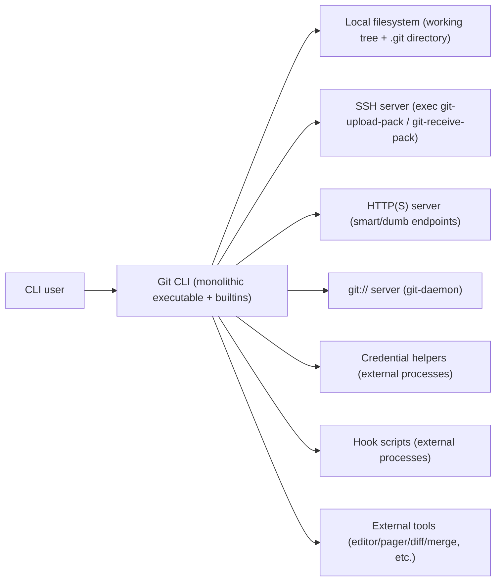

# Git (C) Codebase — High Level Design and Product Architecture

## Table of contents
## Table of contents
- [1. Scope and goals](#1-scope-and-goals)
- [2. System context (C4: System Context)](#2-system-context-c4-system-context)
- [3. Container and service view (C4: Container)](#3-container-and-service-view-c4-container)
- [4. Component view (C4: Component)](#4-component-view-c4-component)
- [5. Interfaces and APIs](#5-interfaces-and-apis)
- [6. Data model and storage design](#6-data-model-and-storage-design)
- [7. Networking protocols and flows](#7-networking-protocols-and-flows)
- [8. Deployment and runtime topology](#8-deployment-and-runtime-topology)
- [9. Cross-cutting concerns](#9-cross-cutting-concerns)
- [10. Tests and validation architecture](#10-tests-and-validation-architecture)
- [11. Documentation generation pipeline](#11-documentation-generation-pipeline)
- [12. Optional integrations and auxiliary tools](#12-optional-integrations-and-auxiliary-tools)
- [13. Appendix: Key source entrypoints](#13-appendix-key-source-entrypoints)

## 1. Scope and goals

This document describes a high-level design (HLD) and product architecture for the Git codebase in this repository. It focuses on the shipped behavior and major subsystems that together implement the Git CLI, repository storage, and network transfer protocols. The intent is to provide an orientation map for contributors and integrators, not to duplicate the full technical specifications already present in the `Documentation/` tree.

Git is a monolithic CLI application implemented primarily in C. It also includes auxiliary programs (helpers, daemons, CGI backends) built from the same source tree, plus extensive documentation and test suites.

## 2. System context (C4: System Context)

Git acts as a local developer tool, and (optionally) as a server-side endpoint for pushing and fetching repository data. Most real deployments involve Git interacting with the local filesystem and one or more remotes over SSH, HTTP(S), or the native `git://` protocol.

### 2.1 External actors and systems

The key external actors and systems are:

A CLI user. The user runs porcelain commands such as `git status`, `git commit`, `git push`, and `git merge`, and occasionally plumbing commands.

The local filesystem (including the working tree and `.git/` directory). Git is fundamentally a filesystem-backed content-addressable database with additional metadata for refs and index state.

Remote servers. A remote may be a Git-aware endpoint reachable over:
- SSH, executing `git-upload-pack` and `git-receive-pack`.
- Smart HTTP, via a Git-aware server (typically `git-http-backend` as CGI or server module).
- `git://` via `git-daemon`.
- Local `file://` transport, which runs the server-side programs locally over pipes.

Credentials and authentication providers. Git can ask external credential helpers to provide and/or store credentials, and may interact with OS credential managers (via helper programs).

Hooks and external tools. Git invokes hook scripts for extensibility, and integrates with external tools (editors, pagers, diff/merge tools, fsmonitor backends, etc.) via subprocess execution.

### 2.2 System context diagram (textual C4)



## 3. Container and service view (C4: Container)

Although Git is often described as “a set of commands”, the implementation is best understood as a single product that can run in multiple *modes*. In most builds, Git produces a `git` executable plus additional executables such as `git-daemon` and (optionally) `git-http-backend`.

### 3.1 Primary container: monolithic CLI

The central container is the `git` CLI, which routes subcommands to “builtins” (compiled-in implementations) and, for some commands, to external `git-<cmd>` programs or scripts.

From an architectural standpoint, the CLI container is responsible for:
- Command parsing and dispatch.
- Repository discovery and setup.
- Calling core libraries for object access, refs, index/worktree operations, etc.
- Starting subprocesses for hooks, helpers, remotes, and external tools.

### 3.2 Server-side pack services

Git’s network protocols are implemented around two canonical server-side services and their matching client-side counterparts:

- `upload-pack` (server) <-> `fetch-pack` (client), used for fetch/clone.
- `receive-pack` (server) <-> `send-pack` (client), used for push.

In this repository snapshot, the server-side programs are builtins:
- `builtin/upload-pack.c`
- `builtin/receive-pack.c`

These services are invoked:
- Remotely over SSH by running `git-upload-pack` / `git-receive-pack`.
- By `git-daemon` for `git://`.
- By `git-http-backend` for smart HTTP.
- Locally via `file://` transport (pipes).

### 3.3 Protocol handlers and daemons

Git includes dedicated containers (executables) for common server deployments:

- `git-daemon` (`daemon.c`), serving repositories over `git://`.
- `git-http-backend` (`http-backend.c`), serving smart/dumb HTTP when hosted as CGI or server module.

These are often embedded behind “outer” servers:
- An SSH server (sshd) that performs authentication and then executes the Git service program.
- An HTTP server (Apache/nginx/lighttpd/etc.) that handles TLS/auth and routes to `git-http-backend`.

## 4. Component view (C4: Component)

Within the monolithic Git implementation, the major subsystems correspond to stable concepts in Git’s storage and operations.

### 4.1 Repository discovery and environment

Repository discovery, path handling, and environment setup is a foundational layer that most commands share. This layer locates `.git/`, determines the working tree, handles common environment variables, and configures repository-specific paths.

### 4.2 Object database (ODB)

The object database is Git’s content-addressed storage layer. Its responsibilities include:
- Reading and writing loose objects.
- Locating objects across loose storage and pack storage.
- Supporting alternates and object replacement strategies used by features like partial clone.

In this codebase, the ODB behavior is largely implemented around `object-file.c` (loose objects, object access helpers) and pack-related modules (see below).

### 4.3 Packfiles and transfer packing

Packfiles are Git’s compact, delta-compressed storage and transfer format. Pack-related responsibilities include:
- Reading existing packfiles and their indexes.
- Creating new packfiles (for repack, fetch responses, push reception, etc.).
- Applying delta compression and heuristics during pack generation.

Key specifications are described in `Documentation/gitformat-pack.adoc`. Packing and protocol transfer are specified in `Documentation/gitprotocol-pack.adoc`, with protocol v2 details in `Documentation/gitprotocol-v2.adoc`.

### 4.4 Refs: reffiles and reftable backends

“Refs” provide human-friendly names to object IDs (branches, tags, remote-tracking branches, etc.). Git supports multiple ref storage formats:
- Traditional loose refs + packed-refs (often referred to as “files” or “reffiles” backend).
- Reftable, a binary, indexed ref storage format designed for scalability.

This repository includes:
- Core refs logic in `refs.c`.
- Reftable backend integration in `refs/reftable-backend.c`.
- The reftable format and rationale described in `Documentation/technical/reftable.adoc`.

### 4.5 Index and working tree orchestration

Git uses an “index” (a.k.a. “cache”) to stage content and to efficiently compute working tree status. Core responsibilities include:
- Parsing and writing the index file.
- Computing differences between index and working tree.
- Supporting checkout/apply operations that materialize trees into the working directory.

An important implementation entrypoint for index operations is `read-cache.c`.

### 4.6 Diff and patch subsystem

Diff is a core shared capability used by many commands (status, log, show, format-patch, apply workflows, etc.). It is used both as a user-facing feature and as an internal primitive (e.g., rename detection and merge presentation). In this repository, diff logic is centered in `diff.c`, while low-level algorithms are supported by bundled libraries (e.g., under `xdiff/`).

### 4.7 Merge, rebase, and history rewriting

Git’s merge and rebase capabilities build on:
- Revision walking and commit graph traversal (not exhaustively covered in this document).
- Diff and merge strategies.
- Index/worktree update orchestration.

Representative major implementations in this repository include:
- Recursive merge logic in `merge-recursive.c`.
- Interactive rebase logic in `rebase-interactive.c`.

### 4.8 Transport, remote, and protocol glue

Git isolates “transport” (the how) from “remote” (the what). The transport layer is responsible for:
- Selecting the protocol implementation (`ssh`, `http(s)`, `git://`, `file://`).
- Invoking the appropriate server-side programs (`upload-pack`, `receive-pack`) or remote helpers.
- Handling negotiation/versioning and feature selection (e.g., protocol v2).

Representative entrypoints include:
- `transport.c` (transport selection and operations).
- `remote.c` (remote configuration and orchestration).

### 4.9 Credentials

Credentials are intentionally handled as an integration boundary, where Git consults credential helpers rather than embedding provider-specific secret storage logic. The C-side credential orchestration is represented by:
- `credential.c` and the public interface `credential.h`.

### 4.10 Hooks

Hooks are Git’s primary extension mechanism for server and client workflows (e.g., `pre-commit`, `pre-receive`, `post-rewrite`, etc.). Hook invocation and management are represented in `hook.c`. Hooks are executed as subprocesses with a defined environment and inputs.

### 4.11 fsmonitor

Git can integrate with filesystem monitoring to accelerate status and index refresh operations. The core implementation is represented by `fsmonitor.c`. In addition, the test harness references daemon support via prereqs such as `FSMONITOR_DAEMON` in `t/test-lib.sh`.

### 4.12 Commit-graph and Bloom filters

Git uses additional derived data structures to accelerate history traversal and queries:
- Commit-graph, used to speed up commit reachability and traversal.
- Bloom filters, used to speed up path-limited history queries and related operations.

Representative entrypoints include:
- `commit-graph.c`
- `bloom.c`

### 4.13 Tracing and diagnostics

Git includes tracing infrastructure for performance and debugging. The trace2 system provides structured traces for various sinks. A representative entrypoint is `trace2/tr2_main.c`.

### 4.14 Garbage collection and maintenance

Git relies on periodic housekeeping to consolidate packs, prune unreachable objects, and maintain performance structures. While the full set of commands and implementation modules is broad, the pack and cruft pack designs are documented in `Documentation/gitformat-pack.adoc`, and maintenance/performance testing is discussed in `t/perf/README`.

## 5. Interfaces and APIs

Git is both a user-facing application and a toolkit of composable commands. Its “APIs” are therefore a combination of CLI contracts, filesystem formats, and wire protocols.

### 5.1 CLI interface: porcelain vs plumbing

Git’s CLI can be understood in two layers:

Porcelain commands are user-oriented and intended for interactive usage. They aim for stable UX semantics, localized messages, and integrated flows.

Plumbing commands are low-level operations intended for composition in scripts and other tools. They favor stable, parseable output and are often closer to internal data models.

In practice, many porcelain commands orchestrate a sequence of plumbing-like operations over the object database, index, refs, and working tree.

### 5.2 Internal component boundaries

Git’s C code is not organized as isolated services, but it does maintain clear internal module boundaries. Examples include:

- Credentials: a narrow interface in `credential.h`/`credential.c` that encapsulates “fill”, “approve”, and “reject” behavior and integrates with helper processes.
- Transport: `transport.c` and `remote.c` act as a boundary between command logic and protocol implementations.
- Protocol framing: pkt-line framing is a shared primitive defined by the protocol specifications (`Documentation/gitprotocol-common.adoc`) and implemented in code (e.g., `pkt-line.c`).
- Refs: the refs layer (`refs.c` and backend-specific implementations like `refs/reftable-backend.c`) provides a common API over multiple storage formats.

### 5.3 Key command/service APIs (conceptual)

The following conceptual APIs (interfaces) are central to Git’s architecture:

- Object access: “given object ID, read object header and content” (loose or packed).
- Ref resolution: “given refname, resolve to object ID (or symref target)”.
- Index operations: “read/update/write index; compare to working tree”.
- Transport operations: “discover remote refs; negotiate objects; transfer pack; update refs”.
- Hook execution: “invoke named hook with well-defined input and environment”.
- Credential operations: “acquire/store credentials via helpers”.

## 6. Data model and storage design

Git’s data model is a set of on-disk formats that together represent history and working state. This section describes the major persistent stores and how they fit.

### 6.1 Repository layout (high-level)

A typical non-bare repository contains:
- A working tree containing checked-out files.
- A `.git/` directory containing the repository database and metadata, including objects, refs, and index.

Bare repositories omit a working tree and store the Git directory as the repository root.

### 6.2 Objects: loose objects and packfiles

Git stores content as immutable objects keyed by their object ID (hash). Objects exist in two primary storage forms:

Loose objects are individual compressed files in `.git/objects/<2-hex>/<38-hex>`. Loose objects are simple and efficient for newly-created objects, but do not scale well for large object counts.

Packfiles are aggregated storage designed for scalability. They store many objects in a compact format and often include delta compression to reduce storage size.

The pack format, index formats, and related files are specified in `Documentation/gitformat-pack.adoc`. This includes:
- `.pack` files for packed object data.
- `.idx` files for indexing (fan-out table, object name lookup, CRCs, offsets).
- `.rev` and `.mtimes` auxiliary files for reverse mapping and timestamp management.
- Multi-pack-index (MIDX) files to index objects across multiple packs.

### 6.3 Delta compression (conceptual)

Packfiles can store objects as deltas against base objects:
- `OBJ_REF_DELTA` references a base object by object ID.
- `OBJ_OFS_DELTA` references a base object by offset within the same pack.

This design enables significant compression in large repositories, and it is a key part of both local storage compaction and network transfer efficiency.

### 6.4 Refs storage: reffiles and reftable

Refs map names like `refs/heads/main` to object IDs (and optionally include peeled targets for annotated tags). Git supports:
- Reffiles (traditional loose ref files + packed-refs).
- Reftable (binary format with indexing and better scaling).

The reftable format and on-disk stack design are described in `Documentation/technical/reftable.adoc`, including:
- Block-based organization with restart tables for efficient lookup.
- Optional object-to-ref indexes to speed up queries like “is this object referenced”.
- Stack/transaction semantics using `tables.list` with atomic updates.

### 6.5 Index (“cache”) storage

The index stores a snapshot of paths, modes, and object IDs representing the staged state. It is used to accelerate status, diff, and commit preparation workflows. The index is updated frequently and is designed for efficient incremental operations.

In this codebase snapshot, index operations are implemented in `read-cache.c` and related modules.

### 6.6 Derived acceleration structures

Git builds auxiliary data structures to accelerate common operations:
- Commit-graph (`commit-graph.c`) accelerates commit traversal and reachability.
- Bloom filters (`bloom.c`) accelerate path-limited history queries.
- Multi-pack-index and related pack auxiliary files (see `Documentation/gitformat-pack.adoc`) reduce the cost of accessing many packs.

## 7. Networking protocols and flows

Git’s networking is defined by a small set of well-specified protocols that all converge on the same core mechanism: advertise refs and capabilities, negotiate object sets, and transfer packfiles.

### 7.1 Common protocol framing: pkt-line

Many Git wire interactions are framed with pkt-lines, a length-prefixed record format specified in `Documentation/gitprotocol-common.adoc`. Pkt-line is used for advertisements, negotiation commands, and multiplexed data streams.

### 7.2 Protocols by transport

Git supports multiple transports that carry essentially the same pack-based protocol:

- `git://` transport: an unauthenticated protocol typically served by `git-daemon` (`daemon.c`). The client sends a pkt-line request identifying the service (usually `git-upload-pack`), and the server executes the corresponding handler.

- SSH transport: the client uses SSH to execute `git-upload-pack` or `git-receive-pack` on the server, then speaks the pack protocol over stdin/stdout.

- Smart HTTP transport: defined in `Documentation/gitprotocol-http.adoc`. HTTP clients begin with an `info/refs?service=<svc>` discovery request, then POST requests to `/git-upload-pack` or `/git-receive-pack`. Protocol v2 can be requested via the `Git-Protocol` header.

- `file://` transport: a local transport that runs the same service programs locally and communicates over pipes.

### 7.3 upload-pack and receive-pack interactions

The pack transfer protocols are specified in `Documentation/gitprotocol-pack.adoc`. At a high level:

Fetch/clone flow:
1. Reference discovery: the server advertises refs and capabilities.
2. Negotiation: the client sends “want” and “have” lines and the server responds with ACK/NAK semantics.
3. Pack transfer: the server streams a packfile (possibly multiplexed with sideband channels).

Push flow:
1. Reference discovery: the server advertises refs and push capabilities.
2. Update commands: the client sends `<old> <new> <ref>` commands describing ref updates.
3. Pack transfer: the client sends the packfile containing needed objects (or an empty pack if required).
4. Report status: the server replies with unpack status and per-ref results; hooks may influence acceptance.

### 7.4 Protocol v2

Protocol v2 is specified in `Documentation/gitprotocol-v2.adoc`. It re-frames the protocol as command-based, where:
- The server advertises capabilities and available commands (e.g., `ls-refs`, `fetch`, and others).
- The client issues explicit commands and arguments.
- The design is stateless by default and is well-suited to HTTP proxying.
- Features like `ls-refs` separate reference advertisement from fetch negotiation, allowing more selective and extensible interactions.

### 7.5 Networking flows diagram (client/server)

```mermaid
sequenceDiagram
  participant C as "Client (git CLI)"
  participant S as "Server endpoint"
  participant UP as "upload-pack / receive-pack"

  C->>S: "Discovery: info/refs (transport-specific)"
  S-->>C: "Advertised refs + capabilities (pkt-line)"

  Note over C,S: "Fetch (upload-pack)"
  C->>S: "Negotiate: want/have/done"
  S-->>C: "ACK/NAK + pack (sideband)"
  C-->>C: "Index-pack; update refs"

  Note over C,S: "Push (receive-pack)"
  C->>S: "Update commands + pack"
  S-->>C: "report-status (ok/ng per ref)"
```

## 8. Deployment and runtime topology

Git is deployed in multiple topologies depending on whether it is used purely locally, as a client to a remote, or as a server component.

### 8.1 Local-only usage

In local-only usage, Git reads and writes repository state entirely on the local filesystem. Processes are typically:
- The `git` CLI process.
- Subprocesses for hooks, editors, credential helpers, and diff/merge tools.

### 8.2 Client/server usage with remotes

In a typical developer workflow with remotes:
- The `git` CLI acts as the client.
- The remote side provides `upload-pack` and `receive-pack`, invoked by SSH, `git-daemon`, or `git-http-backend`.
- Pack transfer happens over the chosen transport and is processed into local storage via pack/index writing.

### 8.3 Daemon and CGI/server-module modes

`git-daemon` (`daemon.c`) can serve repositories over the `git://` protocol. It is commonly run as a long-lived process managed by init systems.

`git-http-backend` (`http-backend.c`) is commonly deployed behind an HTTP server as CGI or as a server module integration, allowing smart HTTP operations and (optionally) dumb HTTP fallbacks.

## 9. Cross-cutting concerns

### 9.1 Performance and scalability

Git’s architecture is performance-oriented and uses multiple strategies:
- Packfiles and delta compression for storage and transfer efficiency (see `Documentation/gitformat-pack.adoc`).
- Indexed lookup structures (pack indexes, MIDX, reftable indexes) to reduce cold-cache latency.
- Derived acceleration structures like commit-graph and Bloom filters (`commit-graph.c`, `bloom.c`).
- Protocol v2’s design to minimize redundant data transfer and enable more selective operations (`Documentation/gitprotocol-v2.adoc`).

### 9.2 Concurrency and atomicity

Git must provide strong consistency for refs updates, especially on servers:
- Ref updates are designed to be atomic at the logical level (e.g., update multiple refs consistently when supported).
- Reftable explicitly describes transactional stacking updates using `tables.list.lock` and atomic rename semantics (`Documentation/technical/reftable.adoc`).
- Many operations rely on lockfiles and atomic renames on the filesystem to avoid partial writes being observed.

### 9.3 Portability

Git targets many Unix-like platforms and also Windows. This results in:
- A portability layer (e.g., `compat/`) and careful avoidance of non-portable shell behaviors in tests.
- Build-time feature flags and conditional behaviors.
- Cross-platform test harness considerations (see `t/test-lib.sh` and `t/README`).

### 9.4 Security

Git’s security model combines protocol, transport, and local validation:
- Authentication is typically delegated to SSH or HTTPS server frontends, rather than embedded in the Git protocol itself (`Documentation/gitprotocol-pack.adoc`, `Documentation/gitprotocol-http.adoc`).
- Credentials are handled through helper processes (`credential.c`, `credential.h`) to integrate with OS credential managers without embedding secrets in core logic.
- Protocol constraints such as object reachability checks and capability negotiation guard against malformed or hostile requests (see the negotiation and “want” constraints described in `Documentation/gitprotocol-http.adoc` and `Documentation/gitprotocol-pack.adoc`).

### 9.5 Extensibility

Git is designed for extensibility through:
- Hooks (`hook.c`) for injecting custom policy and automation.
- External helper processes (credential helpers, remote helpers, filters, etc.).
- Configuration-driven behavior and format evolution (e.g., protocol v2, reftable).

## 10. Tests and validation architecture

Git includes a multi-layer test strategy:

### 10.1 Integration tests (shell-based)

The `t/` directory contains the primary integration test suite. Tests are shell scripts that use a shared harness in `t/test-lib.sh` and are organized by naming conventions described in `t/README`. The harness:
- Creates isolated “trash” repositories per test.
- Provides utilities for assertions and environment normalization.
- Supports parallel execution via TAP harnesses (e.g., `prove`), verbose logging, valgrind modes, and stress testing.

### 10.2 Performance tests

The `t/perf/` directory contains performance tests described in `t/perf/README`. These tests:
- Compare timings across revisions or repositories.
- Support repeated best-of-N measurement.
- Can be configured to use Scalar integration and special repositories.

### 10.3 C unit tests (Clar-based)

The `t/unit-tests/` area includes C unit tests built on the Clar framework, which is described in `t/unit-tests/clar/README.md`. The unit-test runner entrypoint is `t/unit-tests/unit-test.c`, which adapts options and invokes Clar.

Note: In this repository snapshot, `t/unit-tests/README` is present but is a binary file in the current environment, so this document does not quote it directly. The rest of the unit test system is still identifiable through the Clar README and `unit-test.c`.

### 10.4 Protocol-focused tests

Protocol behavior is validated by integration tests under `t/` (for example, HTTP-related tests such as `t/t5561-http-backend.sh` exist in the repository tree). These tests exercise end-to-end behavior against helper servers and validate the correctness of protocol flows and edge cases.

## 11. Documentation generation pipeline

Git’s documentation is authored primarily in AsciiDoc under `Documentation/` and is built into:
- Man pages (`*.1`, `*.5`, `*.7`),
- HTML documentation,
- Info and PDF outputs for selected documents (e.g., user manual).

The build pipeline is defined in `Documentation/Makefile`. It:
- Enumerates manpage sources (`git-*.adoc`, plus guides and protocol docs).
- Uses `asciidoc` (or optionally `asciidoctor`) to generate DocBook XML and HTML.
- Uses `xmlto` to convert DocBook XML to man pages.
- Includes helper scripts such as `Documentation/cmd-list.sh` to generate command listings and `Documentation/install-doc-quick.sh` to install generated docs into separate repositories (e.g., `git-manpages`, `git-htmldocs`) using `git checkout-index`.

This build structure means that the docs are treated as a product artifact generated from source, with the AsciiDoc sources serving as the canonical truth.

## 12. Optional integrations and auxiliary tools

This repository also contains optional or auxiliary components that complement the core Git CLI:

- fsmonitor integration (`fsmonitor.c`) to accelerate working tree status operations.
- Credential helper ecosystem (implemented externally, with core orchestration in `credential.c`/`credential.h`).
- GUIs and web UIs shipped alongside Git in many distributions, such as `gitk/` and `gitweb/` (these are present as directories in the repository tree and have their own documentation and build/deployment considerations).

## 13. Appendix: Key source entrypoints

This section lists a few representative files used as “anchors” when navigating major subsystems in this repository snapshot:

- Pack services and server endpoints:
  - `builtin/upload-pack.c`
  - `builtin/receive-pack.c`
  - `daemon.c`
  - `http-backend.c`

- Transport/remote orchestration:
  - `transport.c`
  - `remote.c`

- Storage and metadata:
  - `object-file.c`
  - `packfile.c`
  - `refs.c`
  - `refs/reftable-backend.c`
  - `read-cache.c`
  - `commit-graph.c`
  - `bloom.c`

- Extensibility and integration:
  - `credential.c` and `credential.h`
  - `hook.c`
  - `fsmonitor.c`

- Observability:
  - `trace2/tr2_main.c`

- Protocol and format specifications (docs):
  - `Documentation/gitprotocol-common.adoc`
  - `Documentation/gitprotocol-pack.adoc`
  - `Documentation/gitprotocol-http.adoc`
  - `Documentation/gitprotocol-v2.adoc`
  - `Documentation/gitformat-pack.adoc`
  - `Documentation/technical/reftable.adoc`

Task completed: Added a comprehensive Git (C) architecture document in Markdown with C4-style views, diagrams, protocols, storage, tests, and documentation build pipeline coverage.
